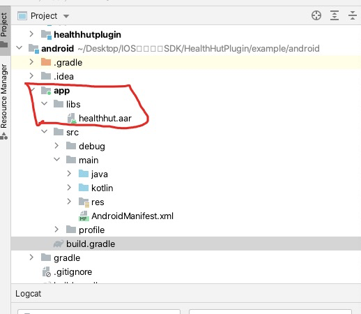
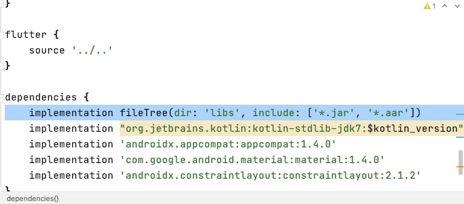
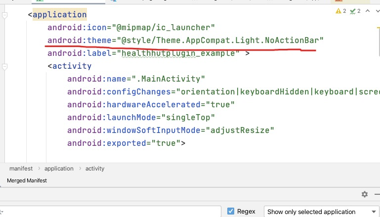
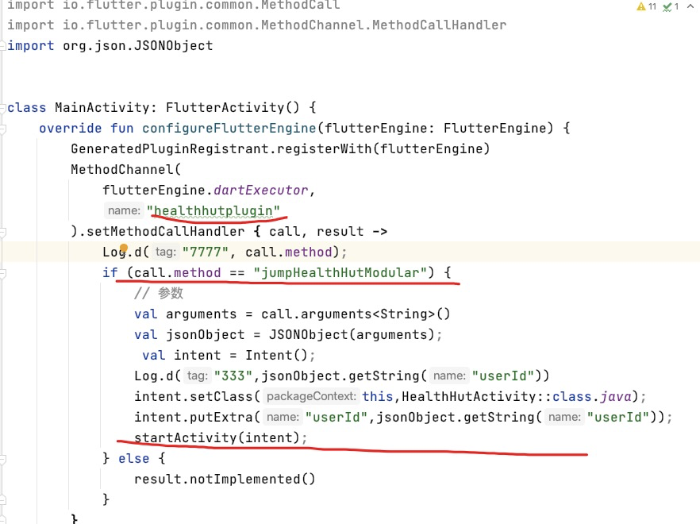

> 1. 在主项目android/app/下面建立libs文件 导入healthhut.aar包。

> 2.在主项目android/app/build.gradle 下面添加引入aar包
```java
    implementation fileTree(dir: 'libs', include: ['*.jar', '*.aar'])

```

>3.修改主项目android/app/src/main/AndroidManifest.xml文件application节点 添加主题android:theme

> 4.在主项目MainActivity中重写 configureFlutterEngine 方法 完全照搬我这种写法



* 具体代码是里可在插件example/android主项目中查看实例
